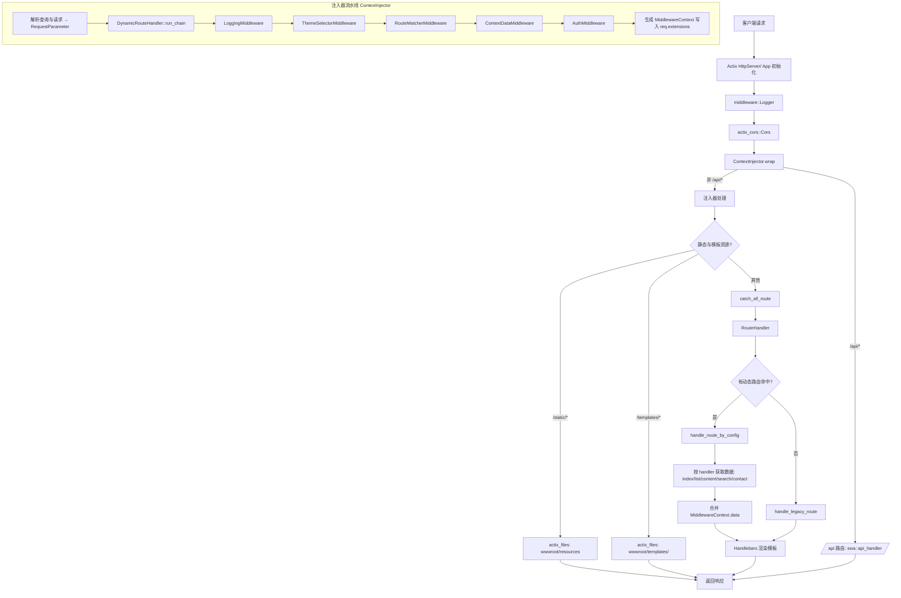

# swa

single website application

## 请求处理流程（swa）

下图与步骤描述了从客户端请求到响应返回在 swa 中的完整执行顺序（按默认配置）：

### 关键执行点（按顺序）

1. main.rs → HttpServer::new 构建 App：
   - .wrap(middleware::Logger::default())
   - .wrap(actix_cors::Cors::default())
   - .wrap(middleware::actix_injector::ContextInjector::new(...))
   - .service(Files::new("/static", ...))
   - .service(Files::new("/templates", ...))
   - .service(web::scope("/api").route(... → swa::api_handler))
   - .service(routing::route_handler::catch_all_route)

2. ContextInjector：对非 /api/* 请求执行自定义中间件链，产出并注入 `MiddlewareContext`：
   - LoggingMiddleware：请求日志标记
   - ThemeSelectorMiddleware：根据 query ?theme 或 Host 判定主题，可能查询站点信息
   - RouteMatcherMiddleware：用 `routes.json` 与 Host(剥离端口) 匹配动态路由，写入 `ctx.route_config` 与路径参数
   - ContextDataMiddleware：聚合通用上下文数据（如站点、分类、导航等）
   - AuthMiddleware：对需要保护的路径进行鉴权（例如 `/admin`）

3. 静态资源与模板资源：
   - /static/* → wwwroot/resources（actix_files）
   - /templates/* → wwwroot/templates 或配置的 base_path（按主题）

4. 动态分发（catch_all_route → RouteHandler）：
   - 优先从 `req.extensions()` 获取步骤2注入的 `MiddlewareContext`
   - 命中动态路由时：`handle_route_by_config`
     - 根据 `route.handler` 调用对应数据处理器：
       - IndexHandler::handle_index
       - ListHandler::get_template_data
       - ContentHandler::get_template_data
       - SearchHandler::get_template_data
       - ContactHandler::get_template_data
     - 合并 `ctx.data` 后通过 Handlebars 渲染 `route.template`
   - 未命中时：`handle_legacy_route` 对历史固定路径进行兜底（/、/content/*、/list/*、/search、/page/* 等）

5. API 请求（/api/*）：
   - 直接进入 `swa::api_handler`，依赖 `tube_web::api` 体系解析参数并分发

### 相关源码定位

- 入口与服务：`swa/src/main.rs`
- 中间件注入器：`swa/src/middleware/actix_injector.rs`
- 中间件实现：`swa/src/middleware/*.rs`
- 动态路由注册表：`swa/src/routing/route_registry.rs`（基于 `routes.json`）
- 动态路由入口：`swa/src/routing/route_handler.rs`
- 处理器：`swa/src/handlers/*.rs`
- 模板与助手：`swa/src/config/template.rs`、`swa/src/helpers/mod.rs`
- 路由配置：项目根 `routes.json`

以上流程可用于排查请求未命中、主题选择异常、模板渲染错误等问题时的快速定位。

swa -t /Users/shaipe/workspace/rust/ecdata/business/site/wwwroot/templates/themes/default -d ./data -p 8090